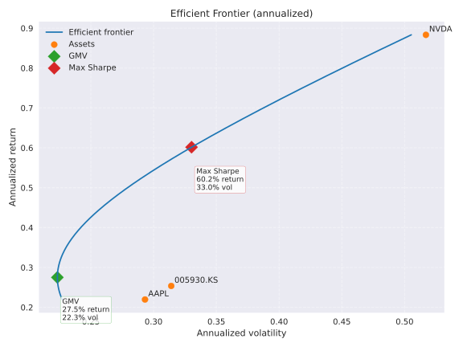

# temp.csv Dataset Analysis

## Dataset Overview
- **File:** `temp.csv`
- **Symbols covered:** Samsung Electronics (005930.KS), Apple (AAPL), NVIDIA (NVDA)
- **Metrics tracked:** Open, High, Low, Close, Volume
- **Date range:** 2023-10-16 to 2025-10-10 (516 trading entries)
- **Source structure:** The CSV uses a two-row header where the first row stores the metric name and the second row stores the ticker symbol. The first column is the ISO-formatted trading date.

## Data Completeness
Missing values correspond to days where a market was closed or data was not supplied. The table below counts the number of dates lacking each metric.

| Ticker | Close | High | Low | Open | Volume |
| ------ | -----:| ----:| ---:| ----:| ------:|
| 005930.KS | 34 | 34 | 34 | 34 | 34 |
| AAPL | 17 | 17 | 17 | 17 | 17 |
| NVDA | 17 | 17 | 17 | 17 | 17 |

## Price and Volume Summary
Average (mean), minimum, and maximum values are computed over available rows per ticker and metric.

### Closing Prices
| Ticker | Avg | Min | Max |
| ------ | ---:| ---:| ---:|
| 005930.KS | 66,471.53 | 48,968.97 | 94,400.00 |
| AAPL | 209.52 | 163.82 | 258.10 |
| NVDA | 115.60 | 40.30 | 192.57 |

### Daily Volume
| Ticker | Avg | Min | Max |
| ------ | ---:| ---:| ---:|
| 005930.KS | 19,481,204.69 | 2,957,915.00 | 57,691,266.00 |
| AAPL | 56,558,297.39 | 23,234,700.00 | 318,679,900.00 |
| NVDA | 325,122,504.81 | 105,157,000.00 | 1,142,269,000.00 |

## Latest Available Observations (2025-10-10)
- 005930.KS closed at 94,400.00 with 35,269,748 shares traded.
- AAPL closed at 245.27 with 61,782,400 shares traded.
- NVDA closed at 183.16 with 266,534,400 shares traded.

## Efficient Frontier Analysis
Daily percentage returns were computed from the closing price series for all three tickers on dates where quotes were available for every asset. The returns were annualized with a 252-trading-day convention, and covariances/volatilities were scaled accordingly. All portfolio optimization assumes a 0% risk-free rate.

### Annualized Return and Volatility
| Ticker | Return | Volatility |
| ------ | ------:| ----------:|
| 005930.KS | 25.37% | 31.41% |
| AAPL | 21.97% | 29.31% |
| NVDA | 88.34% | 51.70% |

### Portfolio Highlights
- **Global minimum variance (GMV):** 44.6% 005930.KS, 49.4% AAPL, 6.1% NVDA — 27.51% expected return with 22.33% volatility (Sharpe ratio 1.23).
- **Maximum Sharpe:** 35.2% 005930.KS, 9.0% AAPL, 55.7% NVDA — 60.16% expected return with 33.03% volatility (Sharpe ratio 1.82).

The accompanying [`generate_efficient_frontier.py`](generate_efficient_frontier.py) script reproduces the statistics above, exports CSV summaries (`annualized_stats.csv`, `gmv_weights.csv`, and `max_sharpe_weights.csv`), and regenerates the visualization below:

## Suggested Usage
1. Treat the CSV as a multi-index table: use the first row for the field and the second row for the ticker when loading it (e.g., `pd.read_csv('temp.csv', header=[0, 1])` in pandas).
2. Filter out rows containing `NaN` values if you require contiguous trading histories for a given market.
3. Normalize prices or volumes if comparing securities with very different scales (e.g., use percentage returns or z-scores).

